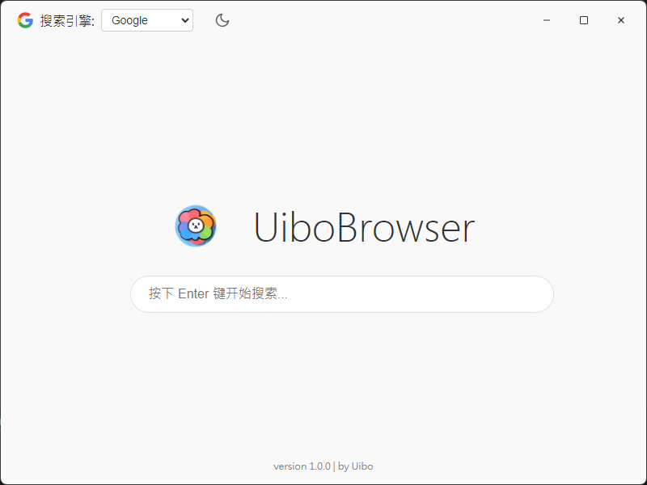

好的，这是 `README.md` 文件的完整 Markdown 格式内容。

你可以直接复制下面代码框中的所有文本，然后粘贴到一个名为 `README.md` 的新文件中。

```markdown
# UiboBrowser

一款基于 Electron 构建的、高度可定制的现代化桌面浏览器。


*(提示: 请将你应用的截图命名为 `screenshot.png` 并放置在 `src/assets/` 目录下，以替换此处的预览图)*

##  功能特性

* **完全自定义界面**: 采用无边框窗口设计，实现了独特的双行布局（标题栏 + 工具栏），所有UI元素均由 HTML/CSS 精心打造。
* **双窗口启动模式**:
    * **独立主页**: 启动时首先进入一个轻量级的本地主页，提供快速搜索和设置入口。
    * **全功能浏览器**: 执行搜索后，动态打开一个功能完备的多标签浏览器窗口。
* **多标签页系统**: 支持流畅地创建、切换、关闭标签页，标题会自动更新。
* **可定制化设置 (持久化存储)**:
    * **搜索引擎切换**: 支持在 Google、Bing、百度等多个主流搜索引擎之间自由切换。
    * **动态新标签页**: 新建标签页的内容会自动跟随当前所选搜索引擎的主页。
* **现代化主题**:
    * **浅色/深色模式**: 内置精致的浅色与深色主题。
    * **动画切换**: 主题切换时带有平滑的CSS过渡动画，体验自然。
* **原生体验集成**:
    * **自定义窗口控制**: 实现了自定义的最小化、最大化/还原、关闭按钮。
    * **窗口拖动**: 支持拖动标题栏和标签栏区域来移动窗口。
    * **右键上下文菜单**: 在网页中提供标准的右键菜单功能（如复制、粘贴、检查元素等）。
* **专业打包支持**:
    * 配置了 **Electron Forge**，可一键打包成 Windows 平台的 `.exe` 安装包和 `.zip` 便携版。

##  技术栈

* **核心框架**: [Electron](https://www.electronjs.org/)
* **运行环境**: [Node.js](https://nodejs.org/)
* **前端技术**: HTML5, CSS3, JavaScript (ES6+)
* **核心依赖**:
    * `electron-store`: 用于持久化存储用户设置（如主题、搜索引擎）。
    * `electron-context-menu`: 快速集成功能丰富的右键菜单。
    * `@electron-forge/cli`: 用于项目打包和构建。

##  项目结构

项目源代码统一存放在 `src` 目录下，结构清晰，便于维护。

```

src/
├── assets/          // (可选) 未来用于存放图片、字体等静态资源
├── main/
│   └── index.js     // 主进程逻辑
├── preload/
│   └── index.js     // 预加载脚本 (主进程与渲染进程的桥梁)
└── renderer/
├── browser/     // 浏览器主窗口的相关文件
│   ├── index.html
│   ├── renderer.js
│   └── style.css
└── homepage/    // 主页窗口的相关文件
├── homepage.html
├── homepage.js
└── homepage.css

````

##  如何运行

1.  确保你已安装 [Node.js](https://nodejs.org/) 和 npm。
2.  克隆或下载本仓库代码。
3.  在项目根目录下打开终端，安装项目依赖：
    ```bash
    npm install
    ```
4.  运行应用：
    ```bash
    npm start
    ```

##  如何打包

本项目已配置好 Electron Forge，可以轻松打包为可分发应用。

1.  在项目根目录下打开终端。
2.  运行打包命令：
    ```bash
    npm run make
    ```
3.  打包完成后，所有可分发文件都会生成在项目根目录下的 `out` 文件夹内。
    * **Windows 安装包**: 位于 `out/make/squirrel.windows/x64/` 目录下。
    * **便携版 (Zip)**: 位于 `out/make/` 目录下。

##  作者

**Uibo**

````
